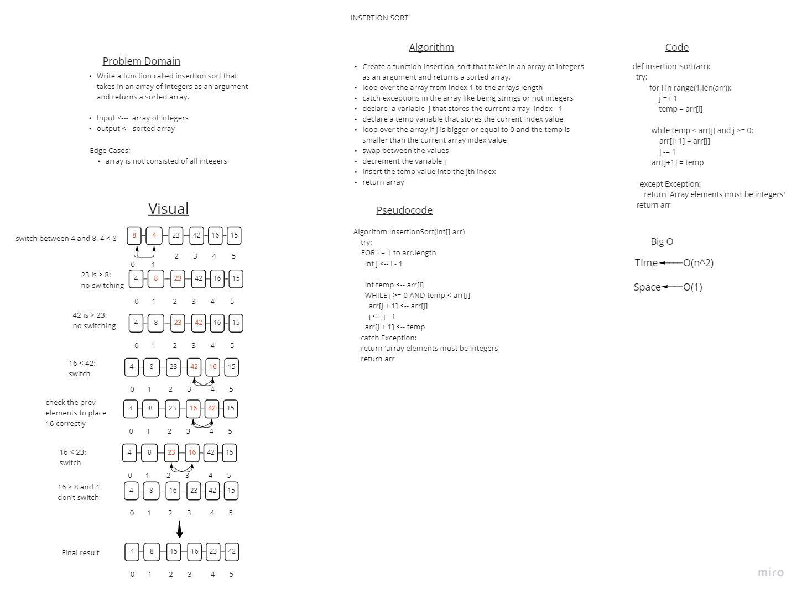

# Challenge Summary
<!-- Description of the challenge -->
Write a function called insertion sort that takes in an array of integers as an argument and returns a sorted array.

Input <---  array of integers
output <-- sorted array

## Whiteboard Process
<!-- Embedded whiteboard image -->


## Approach & Efficiency
<!-- What approach did you take? Why? What is the Big O space/time for this approach? -->
implementation of insertion sort
I used two loops to iterate through the array. The first loop started at the index 1 and the second loop start at index 0 of the same array, to compare between them and see if the first is greater than the second. If it is, then we swap the two values.
The Big O time was O(n^2) 
The Big O space was O(1)

## Solution
<!-- Show how to run your code, and examples of it in action -->
```
    try:
        for i in range(1,len(arr)):
            
            j = i-1
            # temp min value of the array
            temp = arr[i]
            # while the temp value is less than the value at the jth index
            while temp < arr[j] and j >= 0:
                # swap the values
                arr[j+1] = arr[j]
                j -= 1
            # insert the temp value into the jth index
            arr[j+1] = temp  
    # return error message if the array elements are not integers
    except Exception:
        return 'Array elements must be integers'
        
    return arr
```

```
def test_insertion_sort():
    arr = [5, -1, 10, -5]
    actual = insertion_sort(arr)
    expected = [-5, -1, 5, 10]
    assert actual == expected

def test_insertion_sort2():
    arr = [8,4,23,42,16,15]
    actual = insertion_sort(arr)
    expected = [4, 8, 15, 16, 23, 42]
    assert actual == expected
```