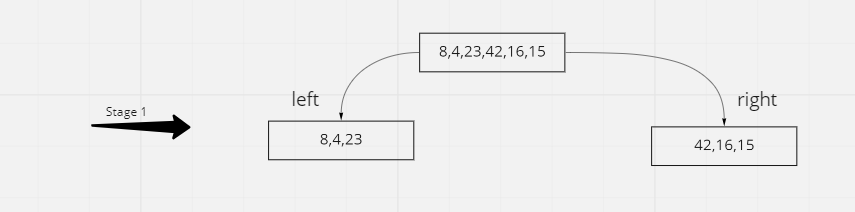
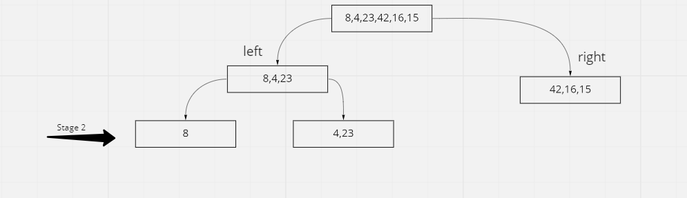
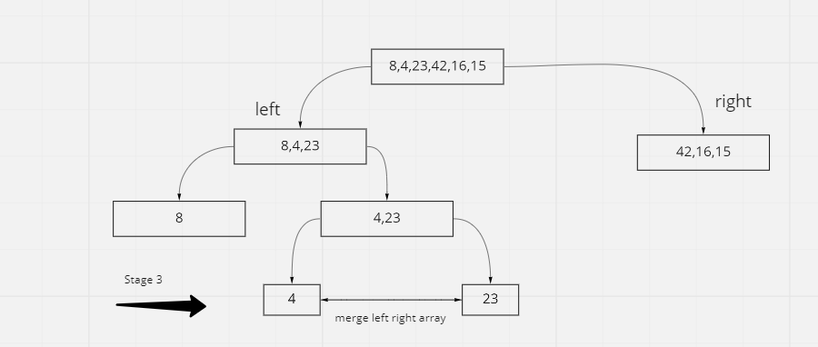
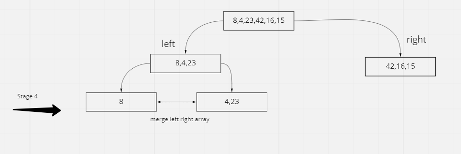
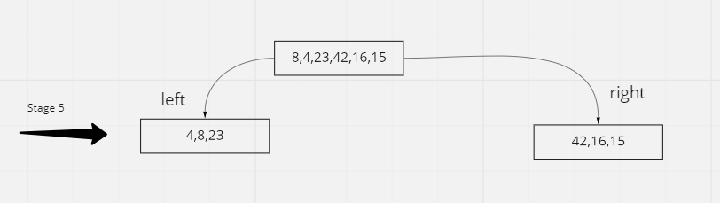
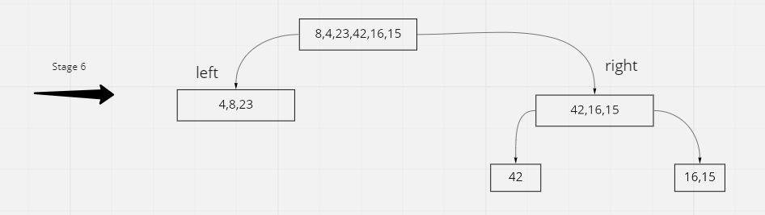
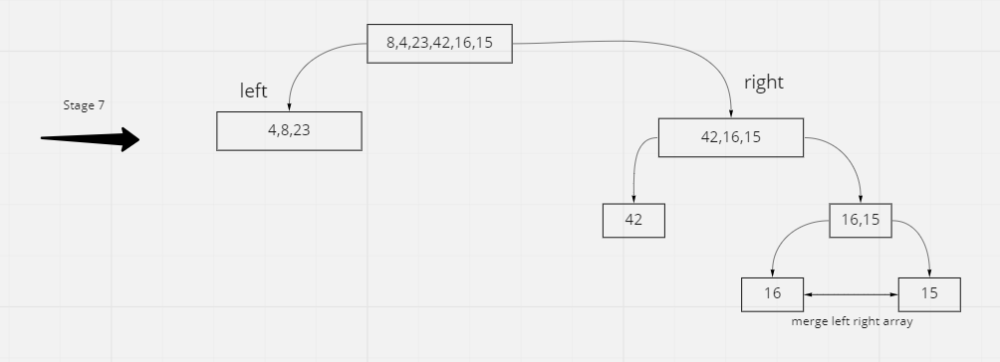
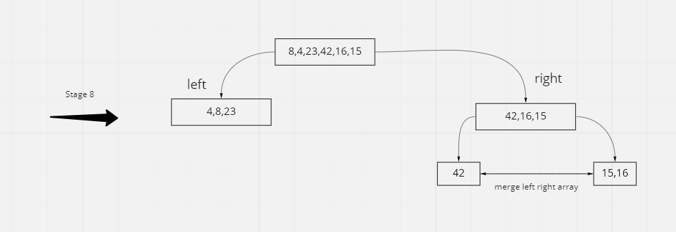
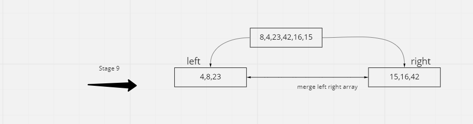
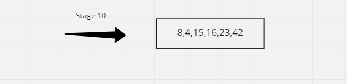

# Merge Sort Description
its a divide and conquer algorithm that recursively splits the array into two halves and keeps spliting until only one element exists in both halves then sorts and merges the two sorted halves.

## Pesudo Code:

The main algorithm code used for splitting the array into two halves and sending them into the sorting algorithm.
```
ALGORITHM Mergesort(arr)
    DECLARE n <-- arr.length

    if n > 1
      DECLARE mid <-- n/2
      DECLARE left <-- arr[0...mid]
      DECLARE right <-- arr[mid...n]
      // sort the left side
      Mergesort(left)
      // sort the right side
      Mergesort(right)
      // merge the sorted left and right sides together
      Merge(left, right, arr)
```

The sub algorithm code used to sort the left and right sides of the array.
and place the values in the correct place in the array then merge them. 


```
ALGORITHM Merge(left, right, arr)
try:
    DECLARE left_index <-- 0
    DECLARE right_index <-- 0
    DECLARE array_index <-- 0

    while left_index < left.length && right_index < right.length
        if left[left_index] <= right[right_index]
            arr[array_index] <-- left[left_index]
            left_index <-- left_index + 1
        else
            arr[array_index] <-- right[right_index]
            right_index <-- right_index + 1

        array_index <-- array_index + 1

    if left_index = left.length
       set remaining entries in arr to remaining values in right
    else
       set remaining entries in arr to remaining values in left
catch Exception: 
        raise Exception("Array elements must be integers")


```

# Process 

Sample Array:
```
[8,4,23,42,16,15]
```

### Stage 1:

we first start by splitting the array into two halves, left and right according to the array length divided by 2 and flooring it.


### Stage 2:

we then repeat the process for left side to get another left and right, and so on until we have a single element in each side.


### Stage 3:

We then repeat the process for right side to get another left and right, now that we only have one element in each side we call the merge function and go through if statements to see if left[0] < right[0] if so then the array[0] <-- left[0] else the array[0] <-- right[0]


### Stage 4:

After merging the 4 and 23 and get the [4,23] we then merge this array with the left side [8] and get the [4,8,23] by going through the if statements notting that since [4,23] has more elements than the left side, so we just add the rest of the sorted array to the merged array



### Stage 5:

Here we exist out of the merge_sort(left) function and enter the same process but this time for the right side  merge_sort(right). 



### Stage 6:
splitting the right side [42,16,15] 



### Stage 7:
same as Stage 6. until we get to 1 element each side 16, 15, so we call the merge function ([16],[15],[16,15]), then we merge the two arrays and get the sorted array [15,16]



### Stage 8:

same process for merge([15,16],[42],[15,16,42]) and come out with [15,16,42]



### Stage 9:
after existing through all the recursion we wind up to the last two arrays [15,16,42] and [4,8,23] and call the merge function ([15,16,42],[4,8,23],[15,16,42,4,8,23]) and get the sorted array [4,8,15,16,23,42]

Note: we will compare each element from the left to each of the right to make sure everything is sorted correctly.



### Stage 10:

The final result



