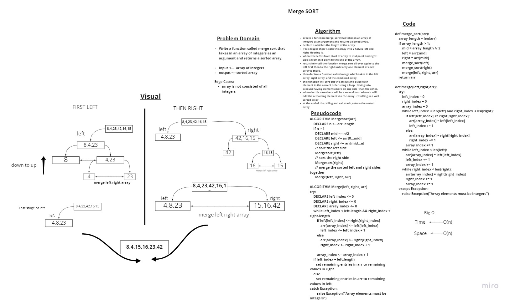

# Challenge Summary
<!-- Description of the challenge -->


write a Merge Sort algorithm that takes in an array as argument and returns a sorted array


Merge Sort is a Divide and Conquer algorithm. It divides the input array into two halves, calls itself for the two halves, and then it merges the two sorted halves. The merge() function is used for merging two halves.


## Whiteboard Process
<!-- Embedded whiteboard image -->


## Approach & Efficiency
<!-- What approach did you take? Why? What is the Big O space/time for this approach? -->
merge_sort function is done recursively and using the merge function which uses 2 while loops but not nested so, Big O time is O(n). and Big O space is O(n).

## Solution
<!-- Show how to run your code, and examples of it in action -->

```
def test_merge_sort():
    array = [12, 11, 13, 5, 6 ]
    actual = merge_sort(array)
    expected = [5, 6, 11, 12, 13]
    assert actual == expected
```

