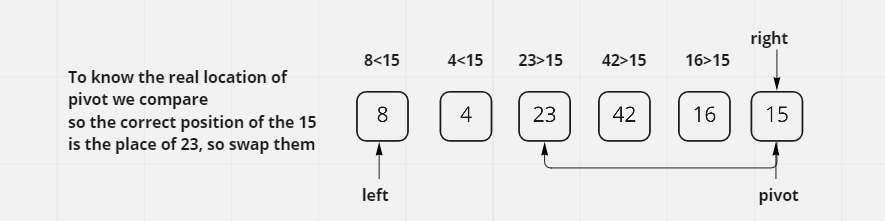
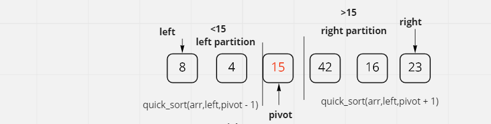
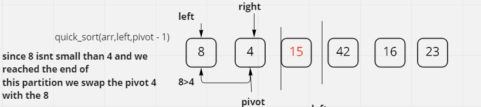
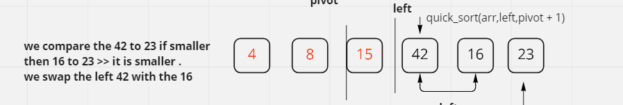
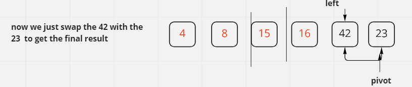
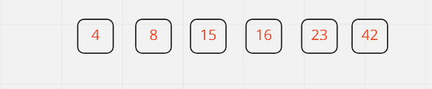

# QuickSort

Quick Sort does the opposite of merge sort in that it will compare the left to the pivot number, and all the integers through the array in between. If one of the integers is less than the pivot, that position is "swapped" with the left integer(or the second pointer). However, if none of the numbers in between are less than the pivot, that pivoted integer will switch with the left at whatever index. This will continue until all numbers are sorted and in sequential order.

## PseudoCode

```
"""
ALGORITHM QuickSort(arr)
    if type(arr) != array:
        //if type of the input is not an array, raise error
        raise TypeError("Input must be a list")
        // call the main quick sort function
    return QuickSort2(arr,0,len(arr)-1)

ALGORITHM QuickSort2(arr, left, right)
    if left < right
        // Partition the array by setting the position of the pivot value
        DEFINE position <-- Partition(arr, left, right)
        // Sort the left
        QuickSort(arr, left, position - 1)
        // Sort the right
        QuickSort(arr, position + 1, right)

ALGORITHM Partition(arr, left, right)
    try:
    // set a pivot value as a point of reference
    DEFINE pivot <-- arr[right]
    // create a variable to track the largest index of numbers lower than the defined pivot
    DEFINE low <-- left - 1
    for i <- left to right do
        if arr[i] <= pivot
            low++
            Swap(arr, i, low)
    

     // place the value of the pivot location in the middle.
     // all numbers smaller than the pivot are on the left, larger on the right.
     Swap(arr, right, low + 1)
    // return the pivot index point
     return low + 1
    catch if expection happens raise error

ALGORITHM Swap(arr, i, low)
    DEFINE temp;
    temp <-- arr[i]
    arr[i] <-- arr[low]
    arr[low] <-- temp

"""
```

Sample Array:
```
[8,4,23,42,16,15]
```

### Pass 1


The first step will verify whether the left[0] is less than the right[5]. Left[0] = 8 is less than Right[5] = 15 so the condition is met. A second pointer is then created at left[0]. We then define the position variable as being equal to the Partition function. Elements less than the pivot are kept on the left side and elements greater than pivot are on the right side of the pivot. This is showcased at the end of our QuickSort function.

The partition function (arr, left, right) defines the pivot as the array[right] = arr[5] = 15. We then define low is equal to left = 0 -1 = -1. A for loop is entered only when the conditional, if index is between left and right, is true. If the arr[index] is less than or equal to the pivot = 15, we will then increment the low. Due the fact that within the array, there is a number that is less than 15 (integer at the index of 1 = 4), we will then increment the low = -1 + 1 = 0, and then the swap function is now invoked.

The swap function will first take in the array, index = 0, and the low= 0. We then define the temp as the arr[index=0] = 8. The arr[low is now 0] = 8 is now replacing the arr[0] = 8. Now temp is equal to 8. We then increment the low = 0 +1 = 1. The quick sort method will now adjust the second pointer and the pivot for the new pass.

Pivot = 15 pivot  8 4// 23 [15] 42, 16

It keeps going for the 2nd index which is the 1 and replaces nothing because it is the same element of the array 4.

after than the index of the for loop will keep increasing and checking if the element of that index is less or equal to the pivot. but looking at the array nothing is less or equal to 15.

so the final approach in this step is to swap the pivot with the arr[low +1] which is the 23
so array will be:

New Pass: [8,4,15,42,16,23]





### Pass 2

We will now do the same process for the second pass. calling the quicksort function for the arr, left and the pivot -1 which is the partition that is less than 15 of index 2. 
quicksort(arr,left,pivot-1)
checking if left = 0 < right = 1 

entering the partition function we reasign the pivot to the arr[1] = 4, low = -1, we enter the for loop once again. and since the arr[0] = 8 is not less than the pivot = 4, exitting from the loop we swap the 8 and the 4.



New Pass: [4,8,15,42,16,23]


### Pass 3

Now returning to the last quicksort call, we find out that the right now is -1 and left is still 0 so comparing them,we find out that the left is sorted correctly, so we continue to call the quicksort(arr,pivot+1,right) for the right partition(bigger than the previous pivot 15).

left: 3
right: 5
pivot = 23

tested arr part : [42,16,23]
index = 3
low = 2

entering the for and checking if 42 <= 23(pivot)
it isnt so we increment the index to 4 and check if 16 <= 23, yes it is so we increment the low to 3 and swap the (42--low) and 16.


New Pass: [4,8,15,16,42,23]


### Pass 4

Once we leave the for we swap the arr,right and low+1
so we swap the right=23 and low=42 to get the 

final result: [4,8,15,16,23,42]



