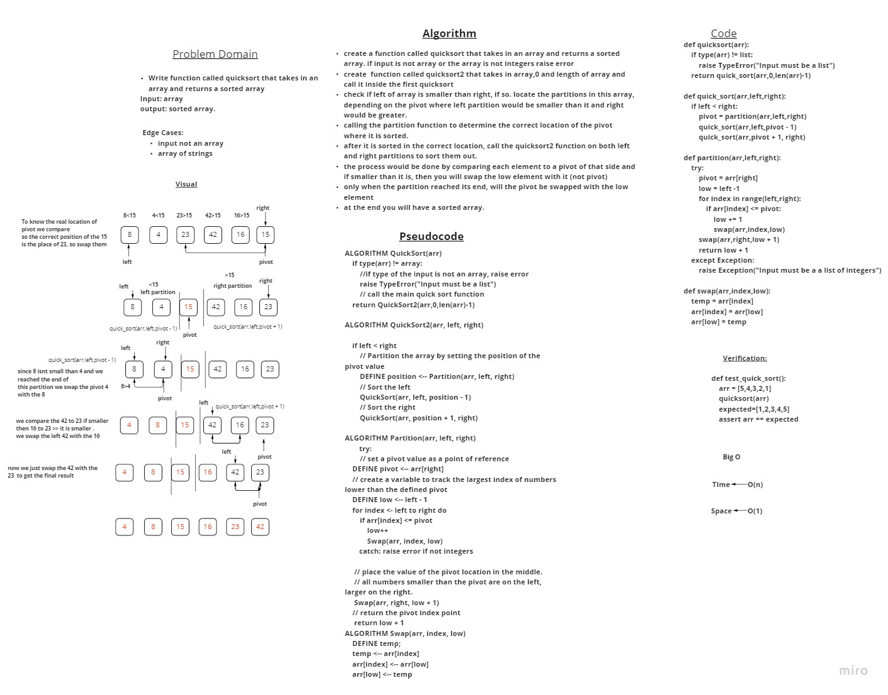

# Challenge Summary
<!-- Description of the challenge -->
Write function called quicksort that takes in an array and returns a sorted array
Input: array
output: sorted array.

## Whiteboard Process
<!-- Embedded whiteboard image -->


## Approach & Efficiency
<!-- What approach did you take? Why? What is the Big O space/time for this approach? -->
Time complixity is O(n) because we are using recursion and going through the .
Space complixity is O(1) because we are only using a single variable.


## Solution
<!-- Show how to run your code, and examples of it in action -->
```
def quicksort(arr):
    if type(arr) != list:
        raise TypeError("Input must be a list")
    return quick_sort(arr,0,len(arr)-1)

def quick_sort(arr,left,right):
    if left < right:
        pivot = partition(arr,left,right)
        quick_sort(arr,left,pivot - 1)
        quick_sort(arr,pivot + 1, right)

def partition(arr,left,right):
    try:
        pivot = arr[right]
        low = left -1
        for index in range(left,right):
            if arr[index] <= pivot:
                low += 1
                swap(arr,index,low)
        swap(arr,right,low + 1)
        return low + 1
    except Exception :
        raise Exception("Input must be a list of integers")
```
```
def test_quick_sort():
    arr = [5,4,3,2,1]
    quicksort(arr)
    expected=[1,2,3,4,5]
    assert arr == expected
```