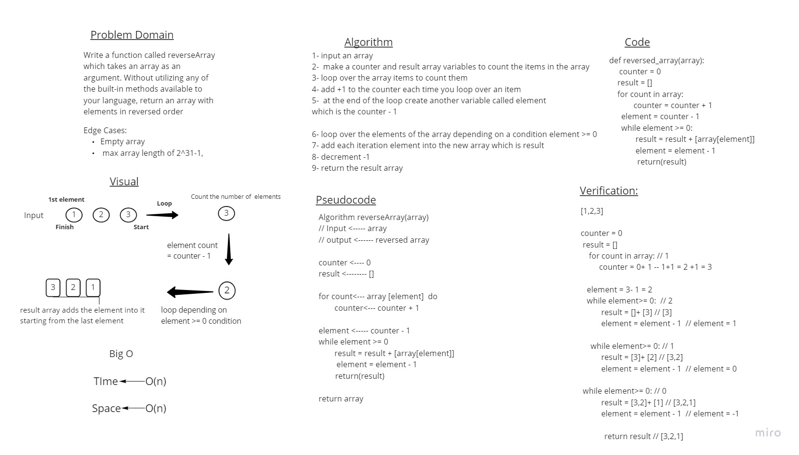

# Reverse an Array 

Write a function called reverseArray which takes an array as an argument. Without utilizing any of the built-in methods available to your language, return an array with elements in reversed order.
Taking in mind these limitations ( inputing an Empty array, or max array length of 2^31-1,) are 
unacceptable 

 

## Whiteboard Process

## Approach & Efficiency

We only have to return a reversed array of that array without using loops 
the Time and Space would be O(n).