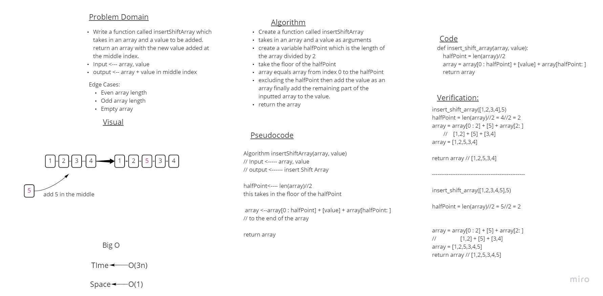

# Insert Shift Array 

Write a function called insertShiftArray which takes in an array and a value to be added to the array at the middle index. and return the array.
Input <--- array, value
output <-- array + value in middle index

Edge Cases:
- Even array length
- Odd array length
- Empty array

 

## Whiteboard Process

## Approach & Efficiency

We only have to return an array with a value inputted in the middle index of that array and the Time O(3n) and Space would be O(1).