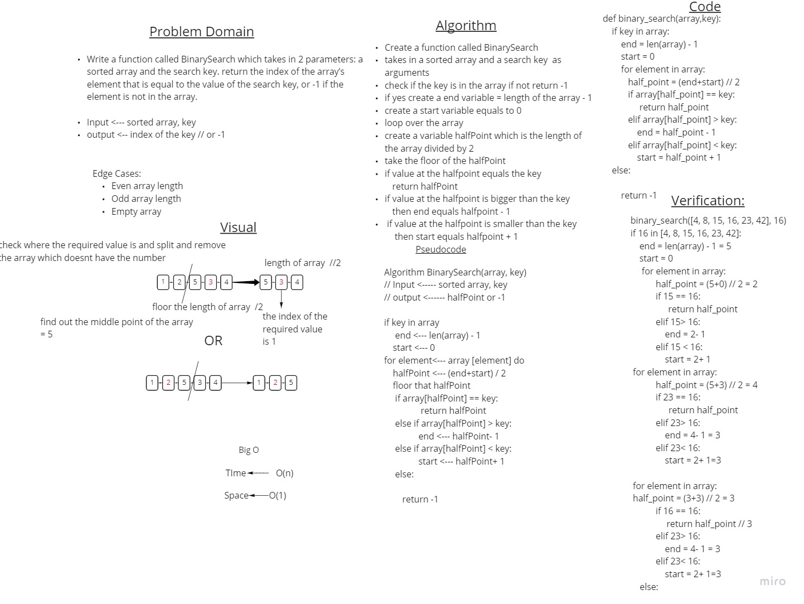

# Array Binary Search 
Write a function called BinarySearch which takes in 2 parameters: a sorted array and the search key. return the index of the array’s element that is equal to the value of the search key, or -1 if the element is not in the array.

Input <--- sorted array, key
output <-- index of the key // or -1

Edge Cases:

- Even array length
- Odd array length
- Empty array

 

## Whiteboard Process

## Approach & Efficiency

We  have to return the index of the key value in the sorted array inputted or return -1 if that key doesnt exist in the array and the Time O(n) and Space would be O(1).

