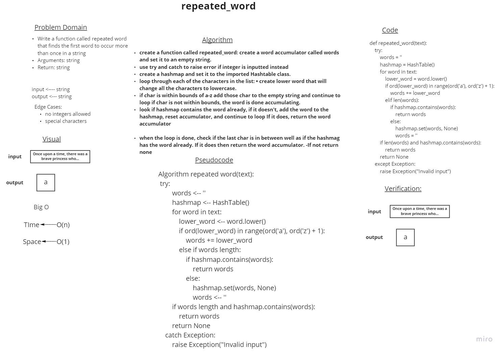
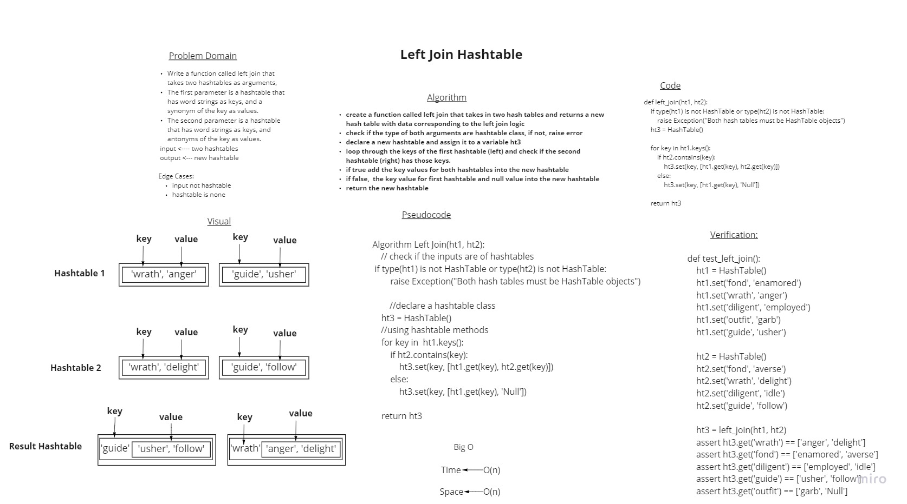

# Hashtables
<!-- Short summary or background information -->
Hashtables are data structures that store data in key-value pairs.
and if a collison happens within the table then it would be added to the same index without overwriting the previous value.

## Challenge
<!-- Description of the challenge -->
Implement a Hashtable Class with the following methods:
set(key, value)
get(key)
contains(key)
keys()
hash(key)

## Approach & Efficiency
<!-- What approach did you take? Why? What is the Big O space/time for this approach? -->
Big O is (n) because of the possibility of collision.
but wit a perfect hash table it would be a O(1)


## API
<!-- Description of each method publicly available in each of your hashtable -->
    """
    HashTable is a class that inherits from object and has the following methods:

    hash(self,key): hash function that takes a key and returns an index in the hashtable. Time complixity is O(n) and space complexity is O(1)

    set(self,key,value): sets a key and value in the hashtable, O(n) space complexity and O(1) time complexity if key index doesnt exist and O(n) time and space complexity is O(n) if key index does exist.

    get(self,key): gets the value of a key, O(n) time complexity and O(1) space complexity

    contains(self,key): checks if a key is in the hashtable, O(n) time complexity and O(1) space complexity

    keys(self): returns a list of all keys in the hashtable, O(n^3) time complexity and O(n) space complexity
    """

----------------------------------------------------------------------------------------------------------------------

# Challenge Summary
<!-- Description of the challenge -->
Write a function called repeated word that finds the first word to occur more than once in a string
Arguments: string
Return: string

## Whiteboard Process
<!-- Embedded whiteboard image -->

## Approach & Efficiency
<!-- What approach did you take? Why? What is the Big O space/time for this approach? -->
Time -- Big O(n)
Space -- Big O(1)
## Solution
<!-- Show how to run your code, and examples of it in action -->
```
def test_repeated_word():
    text = "Once upon a time, there was a brave princess who..."
    actual = repeated_word(text)
    expected = "a"
    assert actual == expected
```

--------------------------------------------------------------------------------

# Hashmap LEFT JOIN
<!-- Short summary or background information -->
Hashmap left join is a way to join two hashmaps together.
where one hashmap is the left and the other is the right.
right hashmap is the one that is being joined to the left hashmap.
the result of the fusion will be a new hashmap with the keys from the left hashmap.

## Challenge
<!-- Description of the challenge -->
Write a function that LEFT JOINs two hashmaps into a single data structure.

Write a function called left join
Arguments: two hash maps
The first parameter is a hashmap that has word strings as keys, and a synonym of the key as values.
The second parameter is a hashmap that has word strings as keys, and antonyms of the key as values.
Return: The returned data structure that holds the results is up to you. It doesn’t need to exactly match the output below, so long as it achieves the LEFT JOIN logic

## Approach & Efficiency
<!-- What approach did you take? Why? What is the Big O space/time for this approach? -->
Time Big O of (n) because of the possibility of collision.
Space Big O of (n) because of creating a new hashmap 

## Solution
<!-- Embedded whiteboard image -->


- Code: [Left-Join](hashtable/hashtable_leftjoin.py)


