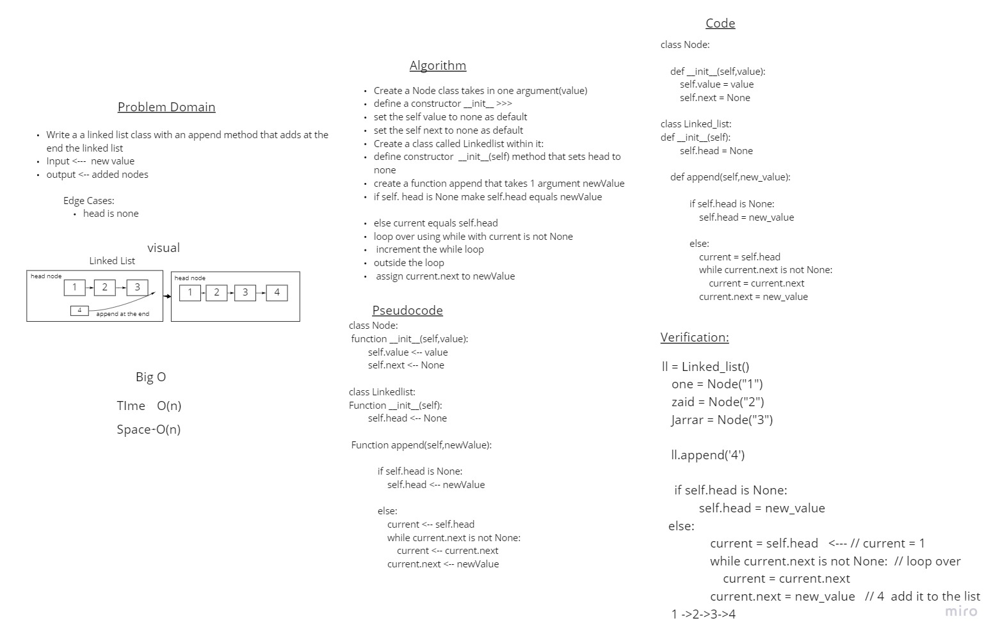
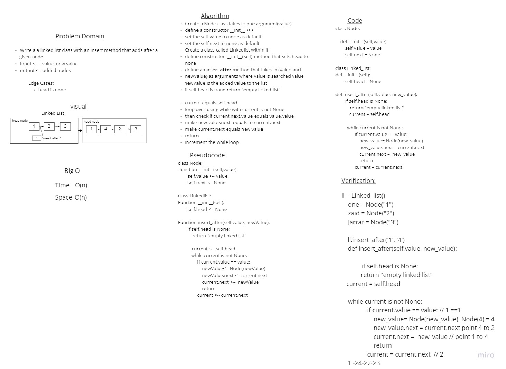
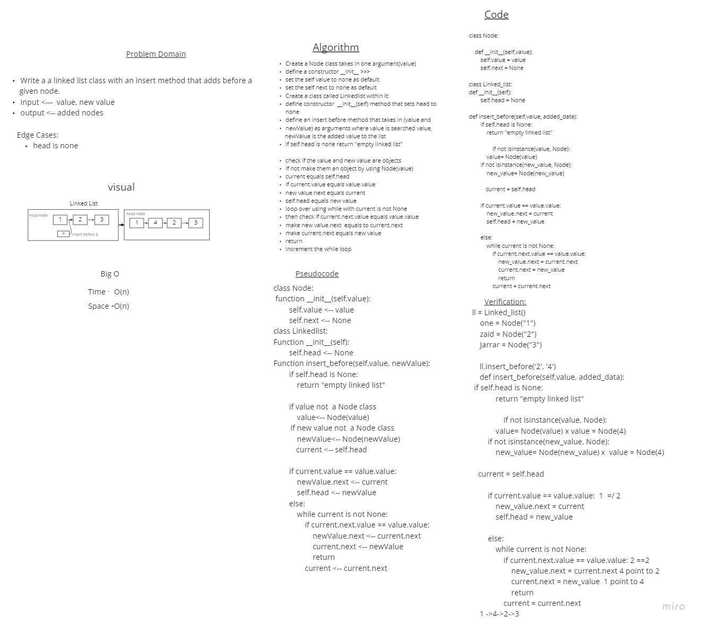

# Singly Linked List

Singly-linked list is the fundamental type among various types of linked which has features:
- Header of dataset will always lead to first data element.
- Each node contains data and link to next data.
- The link in the last node is empty.
- This list is also known as one way chain because the data elements can be accessed in only direction i.e.
first to last. Navigation through dataset in reverse direction is not possible.
- Any data element in this list cannot be accessed randomly and we will have to necessarily traverse sequentially from the first node one by one.

## Challenge

Create a Node class that has properties for the value stored in the Node, and a pointer to the next Node.
Create a LinkedList class that has the following methods inside:

- insert 
- includes
- append
- to string
- __str__
- insert_After
- insert_before

Write tests to prove the following functionality:

- Can successfully instantiate an empty linked list
- Can properly insert into the linked list
- The head property will properly point to the first node in the linked list
- Can properly insert multiple nodes into the linked list
- Will return true when finding a value within the linked list that exists
- Will return false when searching for a value in the linked list that does not exist
- Can properly return a collection of all the values that exist in the linked list

## Approach & Efficiency
- Time complixity is O(n)
- Space complixity is O(n)

## API

- a Node class that has 2 attributes: the value stored and a pointer to the next node(next).
- Linked_list class that contains methods that affect the nodes like: 
- append() method that takes in one argument (value) and adds that value to the end of the list
- insert() method that takes in one argument (value) and adds that at the beginning of the list
- includes() method that takes in one argument (value) and that checks if a value is included in the list and returns a boolean 
- to_string which returns __str__ that represents the objects
- insert_after: add a node after a given node to the linked list
- insert_before: add a node before a given node to the linked list

## Whiteboards

- 
- 
- 

## Pull Link:
[Insert]()

### Tasks checklist:

- [x] Create a Linked List class
- [x] Within your Linked List class, include a head property.
- [x] Upon instantiation, an empty Linked List should be created.
- [x] insert
- [x] includes
- [x] to string
- [x] append
- [x] insert After
- [x] insert Before

--------------------------------------

- [X] Top-level README “Table of Contents” is updated
- [X] README for this challenge is complete
- [x] Summary, Description, Approach & Efficiency, Solution
- [x] Picture of whiteboard
- [x] Link to code
- [x] Feature tasks for this challenge are completed
- [X] Unit tests written and passing
- [X] “Happy Path” - Expected outcome
- [X] Expected failure
- [X] Edge Case (if applicable/obvious)