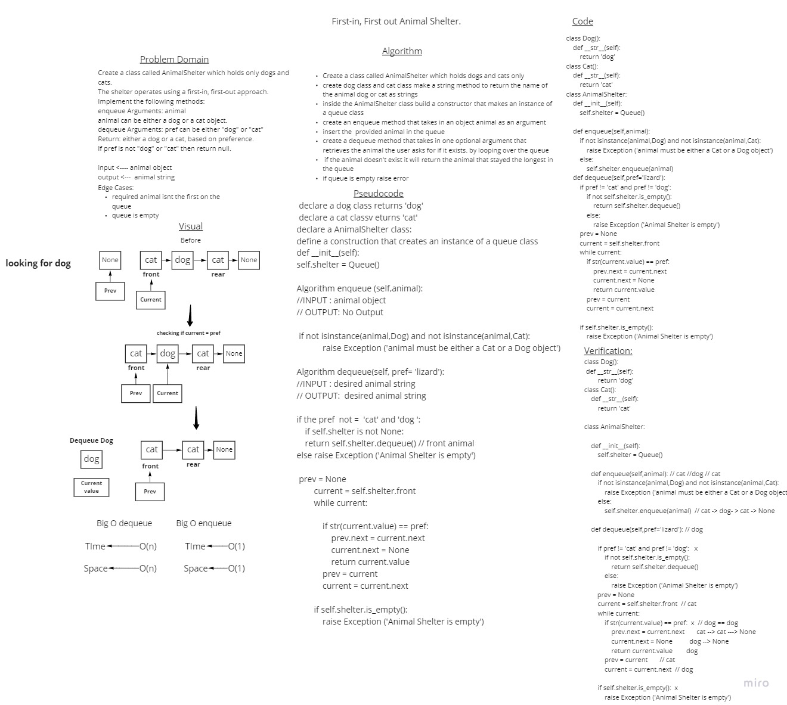

# Stacks and Queues
<!-- Short summary or background information -->
A Stack is a data structure that follows the LIFO(Last In First Out) principle or FILO (First In Last Out)
which has a top pointer

A Queue follows the First-in-First-Out (FIFO) principle, or the LILO (Last in Last Out) principle
and has two pointers one is for the front of the queue ie the dequeue and one for the rear of the queue
ie the enqueue

## Challenge
<!-- Description of the challenge -->
- Create a Stack class that has a top property. It creates an empty Stack when instantiated.
This object should be aware of a default empty value assigned to top when the stack is created.
The class should contain the following methods:
- push
- pop
- peek
- is empty

- Create a Queue class that has a front property. It creates an empty Queue when instantiated.
This object should be aware of a default empty value assigned to front when the queue is created.
The class should contain the following methods:
- enqueue
- dequeue
- peek
- is empty

- Create PseudoQueue class that will implement our standard queue interface (the two methods listed below),
Internally, utilize 2 Stack instances to create and manage the queue
- enqueue method
- dequeue method

- AnimalShelter which holds only dogs and cats. The shelter operates using a first-in, first-out approach.
with the following methods

enqueue method takes in one argument that inserts an animal object into the queue 
dequeue method takes in one optional argument that retrieves  the animal the user inputs if it exists.
if it doesnt it will return the longest stayed animal

- validate_brackets function takes a string of brackets and returns True if the brackets 
are balanced and False otherwise

## whiteboards

  

## Approach & Efficiency
- Big O here is O(1) for both time and space since it is only done on one node at a time hence the O(1) of time. 
and for the space there is no loops or anythong to increase it, so it is a linear relationship so O(1)

- AnimalShelter is O(1) time and space for enqueue and O(n) time and O(n) space for dequeue
- validate_brackets is O(n) for time and space

## API
<!-- Description of each method publicly available to your Stack and Queue-->

    Node class takes in an argument value and creates a new node 

    Stack class has the following methods:
    push: takes in an argument value and pushes a node of that value into the stack which makes the top equal to that node
    pop: takes no arguments and returns the value of the removed node from the top, if stack is empty an exception will be raised
    peek: takes no arguments and returns the value of the top node or the next of the top if exists, if stack is empty an exception will be raised
    is_empty: takes no arguments and returns True if stack is empty, False otherwise

    Queue class has the following methods:
    enqueue: takes in an argument value and pushes a node of that value into the queue which makes the rear equal to that node or if empty rear and front will equal to that node
    dequeue: takes no arguments and returns the value of the removed node from the front, if queue is empty an exception will be raised
    peek: takes no arguments and returns the value of the front node, if queue is empty an exception will be raised
    is_empty: takes no arguments and returns True if queue is empty, False otherwise

    PseudoQueue class will implement our standard queue interface (the two methods listed below)
    Internally, utilize 2 Stack instances to create and manage the queue
    enqueue method:  Inserts value into the PseudoQueue, using a first-in, first-out approach.
    dequeue method:  Extracts a value from the PseudoQueue, using a first-in first-out approach.

    AnimalShelter which holds only dogs and cats.
    The shelter operates using a first-in, first-out approach.
    Implementing the following methods
    enqueue method takes in one argument that inserts an animal object into the queue 
    dequeue method takes in one optional argument that retrieves  the animal the user inputs if it exists.
    if it doesnt it will return the longest stayed animal

    validate_brackets function takes a string of brackets and returns True if the brackets 
    are balanced and False otherwise

- [x] Top-level README “Table of Contents” is updated
- [x] README for this challenge is complete
- [x] Summary, Description, Approach & Efficiency, Solution
- [x] Picture of whiteboard
- [x] Link to code
- [x] Feature tasks for this challenge are completed
- [x] Unit tests written and passing
- [x] “Happy Path” - Expected outcome
- [x] Expected failure
- [x] Edge Case (if applicable/obvious)