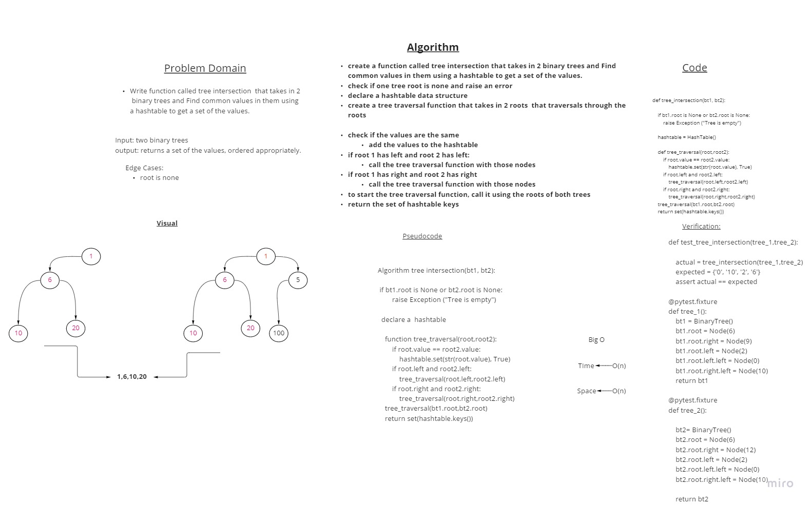

# Challenge Summary
<!-- Description of the challenge -->
Write a function called tree_intersection that takes two binary trees as parameters.
Using your Hashmap implementation as a part of your algorithm, return a set of values found in both trees.

## Whiteboard Process
<!-- Embedded whiteboard image -->


## Approach & Efficiency
<!-- What approach did you take? Why? What is the Big O space/time for this approach? -->
Big time/space O: O(n)

## Solution
<!-- Show how to run your code, and examples of it in action -->
```
def test_tree_intersection(tree_1,tree_2):

    actual = tree_intersection(tree_1,tree_2)
    expected = {'0', '10', '2', '6'}
    assert actual == expected

@pytest.fixture
def tree_1():
    bt1 = BinaryTree()
    bt1.root = Node(6)
    bt1.root.right = Node(9)
    bt1.root.left = Node(2)
    bt1.root.left.left = Node(0)
    bt1.root.right.left = Node(10)
    return bt1

@pytest.fixture    
def tree_2():

    bt2= BinaryTree()
    bt2.root = Node(6)
    bt2.root.right = Node(12)
    bt2.root.left = Node(2)
    bt2.root.left.left = Node(0)
    bt2.root.right.left = Node(10)

    return bt2    
```