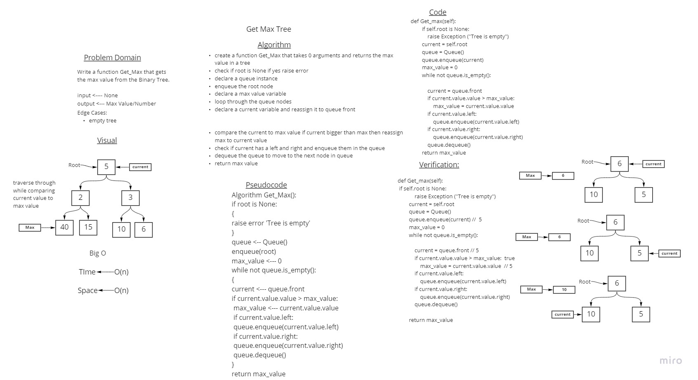
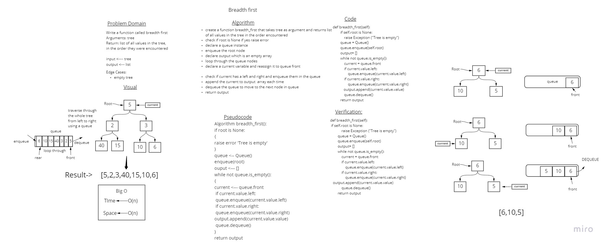

# Trees
<!-- Short summary or background information -->

A Tree is a Data structure in which data items are connected using references in a hierarchical manner. Each Tree consists of a root node from which we can access each element of the tree. Starting from the root node, each node contains zero or more nodes connected to it as children.

## Challenge
<!-- Description of the challenge -->
- Create a Node class that has properties for the value stored in the node, the left child node, and the right child node.
- Create a Binary Tree class
Define a method for each of the depth first traversals:
- **pre_order**
- **in_order**
- **post_order** which returns an array of the values, ordered appropriately.

- Create a Binary Search Tree class this class should be a sub-class of the Binary Tree Class with the following additional methods:
- **Add**:Adds a new node with that value in the correct location in the binary search tree
- **Contains** :boolean indicating whether or not the value is in the tree at least once.


## Approach & Efficiency
<!-- What approach did you take? Why? What is the Big O space/time for this approach? -->
- Add -- Big O(log(n)) time and O(1) space using a while loop
- Contains-- Big O(log(n)) time and O(1) space by calling on of the order methods and search in the return if value is found or not 
- pre order, in_order post_order -- Big O(n) time and O(n) space using recursion
- Get_max: Using a queue instance and a loop ---Big O(n) time and O(n) space
- Breadth_first: Using a queue instance and a loop ---Big O(n) time and O(n) space


## Whiteboard Process
<!-- Embedded whiteboard image -->




## API
<!-- Description of each method publicly available in each of your trees -->
Node:
```
    
    class that has properties for the value stored in the node,
    the left child node, and the right child node.
```    
   
BinaryTree:
```     
    Parent class for binary trees which has 3 methods to order the data 
    Pre-order: root >> left >> right
    In-order: left >> root >> right
    Post-order: left >> right >> root
    Input: None
    doing: traverse a tree
    output: returns an array of the values, ordered appropriately.

    Get_max: takes no arguments and returns the maximum value of the tree
```    

BinarySearchTree:
```
    A subclass of BinaryTree used to add values to the tree and search for them
Add:
    Arguments: value
    Return: nothing
    Adds a new node with that value in the correct location in the binary search tree.
contains:     
    Argument: value
    Returns: boolean indicating whether or not the value is in the tree at least once.
    
```

Breath_first function:
```
Input: Tree as an arugment 
Output: Returns a list of the values in the tree in the order they were encountered.
``` 

## Solution
<!-- Show how to run your code, and examples of it in action -->
Make a binary tree then call in the Get_max method, which will return the maximum value of that tree.
```
[1,2,5,6,10,100]  Tree will return 100 as the maximum value
```
---------------------------------------------------------------------------------
### Breath_first
Call the function breath_first(tree) and input a tree as an argument, which will return a list of the nodes values in the order they were encountered.


- [x] Create Node class
- [x] Create BinaryTree class.
- [x] Create BinarySearchTree class.
- [x] Upon instantiation, an empty BinaryTree should be created.
- [x] pre_order method
- [x] in_order method
- [x] post_order method
- [x] Add method
- [x] Contains method
 

- [x] Top-level README “Table of Contents” is updated
- [x] README for this challenge is complete
- [x] Summary, Description, Approach & Efficiency, Solution
- [x] Picture of whiteboard
- [x] Link to code
- [x] Feature tasks for this challenge are completed
- [x] Unit tests written and passing
- [x] “Happy Path” - Expected outcome
- [x] Expected failure
- [x] Edge Case (if applicable/obvious)